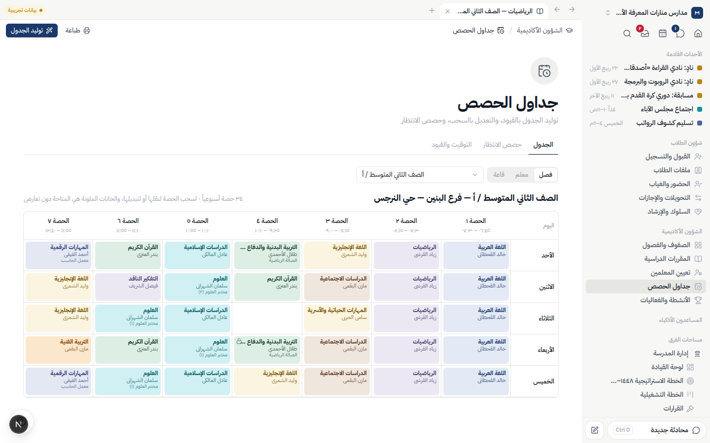

# منصة — نظام إدارة المدارس المتكامل

منصة عربية لإدارة المدارس الأهلية على طراز Notion: مساحات فرق وصفحات وقواعد بيانات بعروض متعددة، بصلاحيات دقيقة (وحدة × إجراء × نطاق)، وسجل تدقيق غير قابل للتعديل، وعزل كامل بين المدارس. واجهة عربية بالكامل من اليمين إلى اليسار، مع التقويم الهجري والميلادي، والوضع الداكن.

> **الحالة:** المرحلتان ١ (الأساس) و٢ (الطلاب والشؤون الأكاديمية) مكتملتان. انظر [تقرير المرحلة ١](docs/PHASE1-REPORT.md) و[تقرير المرحلة ٢](docs/PHASE2-REPORT.md) و[خطة المشروع](docs/PLAN.md).

**وحدات المرحلة ٢:**
- **شؤون الطلاب:** القبول والتسجيل (مع نموذج تقديم عام)، ملفات الطلاب، الحضور والغياب، التحويلات والإجازات، السلوك والإرشاد.
- **الشؤون الأكاديمية:** الصفوف والفصول وإنهاء العام، المقررات وإنجاز الدروس، تعيين المعلمين، جداول الحصص بمولّد قيود وحصص انتظار، الأنشطة والفعاليات.



## التشغيل محلياً

### المتطلبات
- Node.js ‏22.12 أو أحدث
- PostgreSQL ‏16 (قاعدة للتطوير، وقاعدة منفصلة للاختبارات)

### الخطوات

```bash
npm install                       # يولّد عميل Prisma تلقائياً
cp .env.example .env              # ثم عدّل القيم (انظر أدناه)
npm run db:deploy                 # تطبيق الترحيلات على DATABASE_URL
npm run db:seed                   # البيانات التجريبية (مدارس منارات المعرفة الأهلية)
npm run dev                       # http://localhost:3000
```

### متغيرات البيئة الأساسية (`.env`)

| المتغير | الوصف |
|---|---|
| `DATABASE_URL` | قاعدة التطوير |
| `TEST_DATABASE_URL` | قاعدة الاختبارات — **يجب** أن تختلف عن قاعدة التطوير |
| `SHADOW_DATABASE_URL` | قاعدة الظل لـ `prisma migrate dev` |
| `AUTH_SECRET` | سر عشوائي طويل: `openssl rand -hex 32` |
| `FIELD_ENCRYPTION_KEY` | مفتاح تشفير الحقول الحساسة (AES-256-GCM) بطول 32 بايت base64: `openssl rand -base64 32` |
| `APP_URL` | عنوان التطبيق (يُستخدم في روابط الدعوة وإعادة التعيين) |
| `STORAGE_DRIVER` / `STORAGE_LOCAL_DIR` | تخزين الملفات (المحلي فقط في هذه المرحلة) |
| `CRON_SECRET` | سر استدعاء الأتمتة المجدولة `POST /api/cron/automations` |
| `DEMO_MODE` | `true` لإظهار تلميحات الحسابات التجريبية في صفحة الدخول |

## الحسابات التجريبية

> ⚠️ **بيانات تجريبية**: كل الأسماء وأرقام الهوية والجوالات وهمية. تظهر شارة «بيانات تجريبية» في أعلى كل شاشة.

- **كلمة المرور لكل الحسابات:** `Manassa@2026`
- **المصادقة الثنائية** مفعّلة مسبقاً لحسابات المالك والمديرة والمحاسب وأمين الصندوق ومديرة الموارد البشرية والمدقق. الرمز الحالي: `npm run demo:totp`، أو رمز الاسترداد `MANASSA1` (أو `MANASSA2` / `MANASSA3`؛ كل رمز يُستخدم مرة واحدة).

| الدور | البريد | ثنائية |
|---|---|:-:|
| مالك النظام | `owner@demo.manassa.sa` | ✓ |
| مدير المدرسة | `principal@demo.manassa.sa` | ✓ |
| وكيل شؤون الطلاب | `vp.students@demo.manassa.sa` | |
| وكيلة الشؤون الأكاديمية | `vp.academic@demo.manassa.sa` | |
| معلم | `teacher@demo.manassa.sa` | |
| مرشدة طلابية | `counselor@demo.manassa.sa` | |
| مسؤولة القبول | `admissions@demo.manassa.sa` | |
| محاسب | `accountant@demo.manassa.sa` | ✓ |
| أمين صندوق | `cashier@demo.manassa.sa` | ✓ |
| مديرة موارد بشرية | `hr.manager@demo.manassa.sa` | ✓ |
| موظف موارد بشرية | `hr@demo.manassa.sa` | |
| أمينة المكتبة | `librarian@demo.manassa.sa` | |
| مسؤول المرافق | `facilities@demo.manassa.sa` | |
| مسؤول المشتريات | `procurement@demo.manassa.sa` | |
| مسؤول النقل | `transport@demo.manassa.sa` | |
| الاستقبال | `reception@demo.manassa.sa` | |
| ولي أمر | `parent@demo.manassa.sa` | |
| طالب | `student@demo.manassa.sa` | |
| مدقق داخلي | `auditor@demo.manassa.sa` | ✓ |

إضافة إلى ٤٦ معلماً وموظفاً وولي أمر آخرين لإثراء البيانات (منهم ١٧ معلماً أُضيفوا لتغطية أنصبة الجدول). جرّب الدخول بأدوار مختلفة لترى أثر الصلاحيات: المعلم مثلاً يرى مساحة «الشؤون الأكاديمية» فقط ولا يصل لإدارة المستخدمين.

## الأوامر

| الأمر | الوصف |
|---|---|
| `npm run dev` | خادم التطوير |
| `npm run build` / `npm start` | بناء وتشغيل الإنتاج |
| `npm run typecheck` | فحص الأنواع (TypeScript صارم) |
| `npm run lint` | ESLint |
| `npm run test:unit` | اختبارات الوحدات (دون قاعدة بيانات) |
| `npm run test:integration` | اختبارات التكامل على `TEST_DATABASE_URL` (تطبّق الترحيلات تلقائياً ولا تحذف بيانات) |
| `npm run test:e2e` | اختبارات Playwright على خادم التطوير والبيانات التجريبية |
| `npm run db:migrate` | إنشاء ترحيل جديد (تطوير) |
| `npm run db:deploy` | تطبيق الترحيلات |
| `npm run db:seed` | البيانات التجريبية (يرفض التشغيل إن كانت موجودة) |
| `npm run demo:totp` | رمز المصادقة الثنائية الحالي للحسابات التجريبية |
| `npm run screens -- <email> <path>…` | لقطات شاشة (`--dark`، `--mobile`) |

## الخط

الواجهة مصممة لخط **ثمانية (Thmanyah)**. ملفات الخط غير مضمّنة لأسباب الترخيص: ضعها في `public/fonts/` بالأسماء الموضحة في [public/fonts/README.md](public/fonts/README.md) وستُفعَّل تلقائياً. إلى ذلك الحين يُستخدم IBM Plex Sans Arabic.

## البنية باختصار

- **Next.js 16** (App Router) + **React 19** + **TypeScript** صارم
- **PostgreSQL** عبر **Prisma 7**، و**tRPC 11** بين الواجهة والخادم
- **Tailwind CSS 4** برموز تصميم (ألوان رسمية هادئة + وضع داكن)، **motion** للحركات، **dnd-kit** للسحب، **Tiptap** للمحرر
- عزل المدارس: كل استعلام يُقيَّد تلقائياً بالمدرسة عبر امتداد Prisma، وكل إنشاء/تعديل/حذف يُسجَّل تلقائياً في سجل التدقيق مع المستخدم وIP والقيم قبل وبعد، والسجل محمي بمشغّل في قاعدة البيانات يمنع تعديله أو حذفه.

التفاصيل الكاملة: [docs/PLAN.md](docs/PLAN.md).
